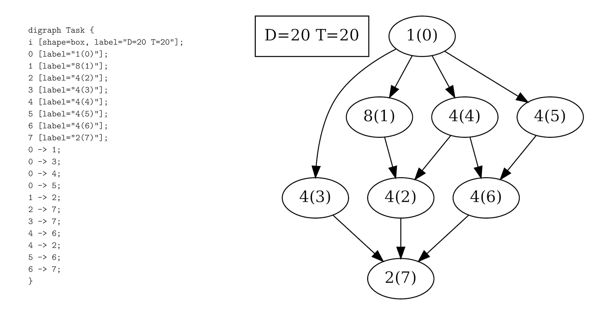
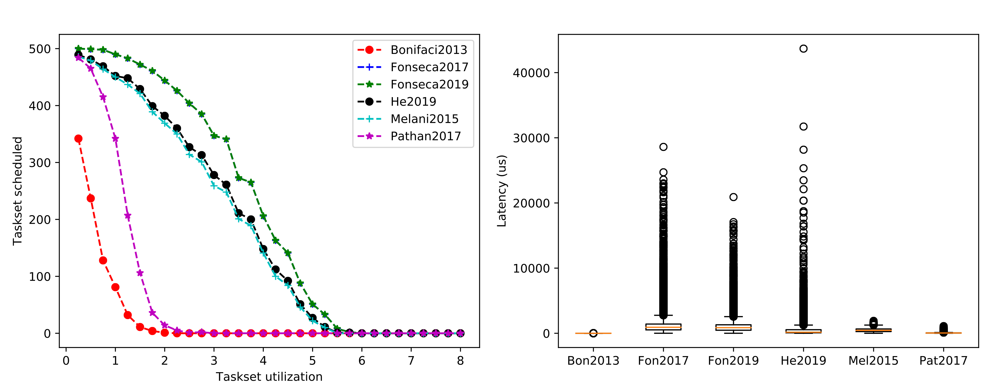

# A library to test schedulability of the real-time DAG task model

This repo offers a library to handle the real-time Directed Acyclic Graph (DAG) task model and its extensions, such as the Conditional DAG and the Typed DAG.
Moreover, several methods from real-time literature have been implemented. 
It's one of the contributions of Micaela Verucchi's Ph.D. thesis "A comprehensive analysis of DAG tasks: solutions for modern real-time embedded systems".

If you use this code in your research, please cite the following paper.

```
@article{verucchi2023survey,
  title={A survey on real-time DAG scheduling, revisiting the Global-Partitioned Infinity War},
  author={Verucchi, Micaela and Olmedo, Ignacio Sa{\~n}udo and Bertogna, Marko},
  journal={Real-Time Systems},
  pages={1--52},
  year={2023},
  publisher={Springer}
}
```

## Dependencies

For this repo the following libraries are needed: graphviz (for dot), libyaml-cpp-dev (to read yaml confi files) and python3-matplotlib (to plot the charts).
On Linux, install the dependencies in this way:

```
sudo apt-get install graphviz libyaml-cpp-dev python3-matplotlib libtbb-dev libeigen3-dev python3-dev


```

## How to compile this repo

Once the dependencies have been installed, build the project with cmake.

```
git clone https://github.com/mive93/DAG-scheduling 
cd DAG-scheduling
git submodule update --init --recursive 
mkdir build && cd build
cmake ..
make 
```

## Input and output

This library reads and outputs DAG in DOT format as shown in the image. 

 

### Input

The library accept two input formats for taskse: yaml or DOT.

#### YAML format

A taskset is specified as an array of task, which has the following params
 * ```t``` the period
 * ```d``` the deadline
 * ```vertices``` array of nodes of the DAG, defined by: 
    * ```id``` id of the node
    * ```c``` WCET of the node
    * ```p``` core to which the node is assigned to [optional]
    * ```s``` gamma, the kind of engine the node is assigned to [optional]

An example is given with demo/taskset.yaml.
#### DOT format

Each DAG is defined via a DOT file, and each path of dot file belonging to the taskset should be written (line by line) in a txt file.
An example is given in demo/dot_files.txt

Each DOT file is the defined with this convention.
At the begninning there is an initial node with the info of the DAG Task, where the deadline ```D``` and the period ```T``` should be specified. For example: 
```i [shape=box, D=603.859, T=1605.45]; ```

Then each node is secified by an ID, a label which represent the WCET and additional optional parameters, as ```p``` and ```s```. For example:
``` 0 [label="57", p=7];```

Finally the edges are discribed only via nodes IDs. For example: 
``` 0 -> 2;```

A complete example is given in demo/test0.dot.

### Output

To convert a dot file into a png image use the following command: 

```
dot -Tpng test.dot > test.png
```

## Demo
The demo is a program that tests all the supported methods on user-defined DAG task set or a randomly generated one.
It can be executed as 

```
./demo <random-flag> <dag-file>
```

where
  * ```<random-flag> ``` can be set to 0 if the taskset should be read from file, or to 1 if the taskset should be randomly generated, using the method proposed by Melani et al. [1][2].
  * ```<dag-file>``` path to the file that describes the task set to analyze if ```<random-flag> ``` is set to 0.

## Eval
The eval program will evaluate several schedulability methods based on a given config file.
To run the evaluation execute:

```
./eval <config-file> <show-plots>
```
Where 
  * ```<config-file>``` is a yml file, like the ones in the data folder, that specifies all the parameters for the task set generation and the selection of the methods to evaluate. 
  * ```<show-plots>``` 1 to show plots, 0 to hide them. In any case, the resulting plots will not be shown but saved in a folder named res.

At the end of each evaluation two kinds of plots will be produced, one regarding the schedulability rate and one the execution times of the methods.

 


## Supported schedulability tests

| Work                  | Workload    | Deadline | Model      | Scheduling | Preemption | Algorithm |
| ----------------------| ----------- | -------- | ---------- | ---------- | ---------- | --------- |
| Baruah2012 [3]        | single task | C        | DAG        | G          | -          | EDF       |
| Bonifaci2013 [4]      | task set    | A        | DAG        | G          | FP         | EDF, DM   |
| Li2013 [5]            | task set    | I        | DAG        | G          | FP         | EDF       |
| Qamhieh2013 [6]       | task set    | C        | DAG        | G          | FP         | EDF       |
| Baruah2014 [7]        | task set    | C        | DAG        | G          | FP         | EDF       |
| Melani2015 [1]        | task set    | C        | DAG, C-DAG | G          | FP         | EDF, FTP  |
| Serrano2016 [8]       | task set    | C        | DAG        | G          | LP         | FTP       |
| Fonseca2016 [14]      | task set    | C        | DAG        | P          | FP         | FTP       |
| Pathan2017 [9]        | task set    | C        | DAG        | G          | FP         | DM        |
| Fonseca2017 [10]      | task set    | C        | DAG        | G          | FP         | DM        |
| Casini2018 [15]       | task set    | C        | DAG        | P          | LP         | FTP       |
| Han2019 [11]          | single task | C        | H-DAG      | G          | \-         | \-        |
| He2019 [12]           | task set    | C        | DAG        | G          | FP         | EDF, FTP  |
| Fonseca2019 [13]      | task set    | C, A     | DAG        | G          | FP         | EDF, FTP  |
| Nasri2019 [16]        |task set     | C        | DAG        | G          | LP         | EDF       |
| Zahaf2020 [17]        |task set     | C        | HC-DAG     | P          | FP, FNP    | EDF       |

 * [1] Alessandra Melani et al. “Response-time analysis of conditional dag tasks in multiprocessor systems”. (ECRTS 2015)
 * [2] https://retis.sssup.it/~d.casini/resources/DAG_Generator/cptasks.zip
 * [3] Baruah et al. "A generalized parallel task model for recurrent real-time processes" (RTSS 2012)
 * [4] Bonifaci et al., "Feasibility Analysis in the Sporadic DAG Task Model" (ECRTS 2013)
 * [5] Li et al. "Outstanding Paper Award: Analysis of Global EDF for Parallel Tasks" (ECRTS 2013) 
 * [6] Qamhieh et al. "Global EDF scheduling of directed acyclic graphs on multiprocessor systems", (RTNS 2013)
 * [7] Baruah et al. "Improved Multiprocessor Global Schedulability Analysis of Sporadic DAG Task Systems" (ECRTS 2014)
 * [8] Maria A Serrano et al. “Response-time analysis of DAG tasks under fixed priority scheduling with limited preemptions” (DATE 2016)
 * [9] Risat Pathan et al.  “Scheduling parallel real-time recurrent tasks on multicore platforms”. (IEEE Transactions on Parallel and Distributed Systems 2017)
 * [10] Fonseca et al. “Improved response time analysis of sporadic dag tasks for global fp scheduling”.  (RTNS 2017) 
 * [11] Meiling Han et al. “Response time bounds for typed dag parallel tasks on heterogeneous multi-cores”. (IEEE Transactions on Parallel and Distributed Systems 2019)
 * [12] Qingqiang He et al. “Intra-task priority assignment in real-time scheduling of dag tasks on multi-cores”. (IEEE Transactions on Parallel and Distributed Systems 2019)
 * [13] Fonseca et al. “Schedulability Analysis of DAG Tasks with Arbitrary Deadlines under Global Fixed-Priority Scheduling”.  (Real-Time Systems 2019) 
 * [14] Fonseca et al. “Response time analysis of sporadic dag tasks under partitioned scheduling”. (SIES 2016)
 * [15] Daniel Casini et al. “Partitioned fixed-priority scheduling of parallel tasks without preemptions”. (RTSS 2018).
 * [16] Mitra Nasri, et al. “Response-time analysis of limited-preemptive parallel DAG tasks under global scheduling”. (ECRTS 2019)
 * [17] Houssam-Eddine Zahaf et al. “The HPC-DAG Task Model for Heterogeneous Real-Time Systems”. (IEEE Transactions on Computers 2020)

